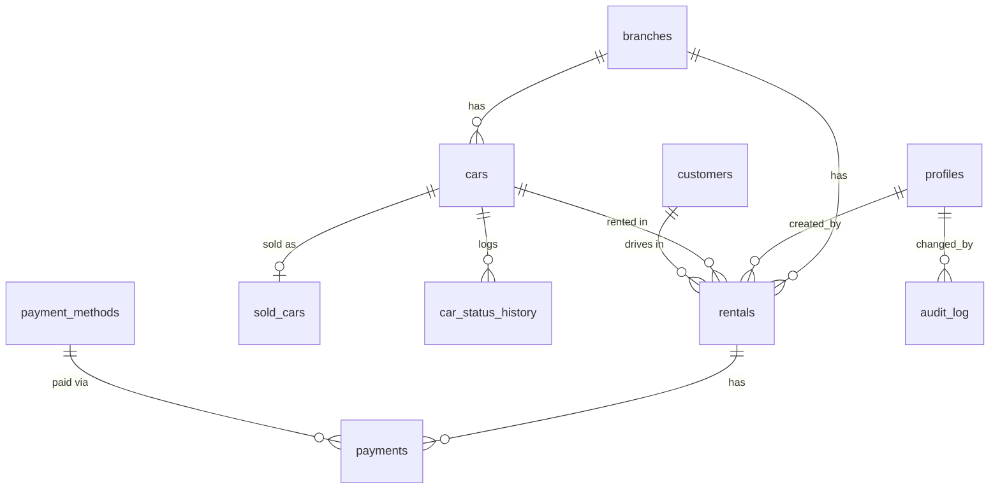

# 03 — Database Design

**Document status:** v1.1 — owner decisions applied (2026-09-27), awaiting final go-ahead
**Database:** PostgreSQL (Supabase)

Conventions:
- Primary keys are `uuid` (`gen_random_uuid()`).
- Money is `numeric(12,2)` in PKR and never a float.
- Timestamps are `timestamptz`, stored in UTC and shown in Asia/Karachi. Business dates (sale date, due date, insurance expiry) are `date`.
- Every table has `created_at`, `updated_at` (set by trigger), and `created_by` / `updated_by` → `profiles.id`.
- Nothing is hard-deleted. `DELETE` is revoked from the API roles on every table.

---

## 1. Entity-relationship overview



**In plain words:**
- A **car** has many **rentals** over its life, but only **one active rental** at a time.
- A **customer** (driver) can have many rentals. The guarantor is stored **on each rental**, because it can differ each time.
- A **rental** has many **payments**: advance, instalments, deposit movements.
- A car that is sold gets exactly **one** `sold_cars` row. The car row stays, with status `sold` and `archived_at` set, so its history remains linked.
- Every car status change writes to **car_status_history**. Every payment edit or void, and every car/rental void, writes to **audit_log**.

## 2. Enumerated types

| Type | Values |
|------|--------|
| `user_role` | `owner`, `staff` |
| `car_status` | `available`, `on_rent`, `maintenance`, `sold` |
| `rent_period` | `daily`, `weekly`, `monthly`, `yearly` |
| `rental_status` | `out`, `returned`, `closed`, `void` |
| `payment_type` | `advance`, `rent`, `deposit_taken`, `deposit_used`, `deposit_returned`, `refund` |
| `fuel_level` | `empty`, `quarter`, `half`, `three_quarter`, `full` |

UI labels: `maintenance` → "At Maintenance", `on_rent` → "On Rent".

## 3. Tables

### 3.1 `branches`

| Column | Type | Constraints |
|--------|------|-------------|
| id | uuid | PK |
| name | text | NOT NULL |
| address | text | |
| phone | text | |
| is_active | boolean | NOT NULL DEFAULT true |
| created_at, updated_at | timestamptz | |

Seed: one row, `Dreamland – Aari Syedan`, `Aari Syedan, Islamabad, Pakistan`.

### 3.2 `profiles` (one per auth user)

| Column | Type | Constraints |
|--------|------|-------------|
| id | uuid | PK, FK → `auth.users.id` |
| full_name | text | NOT NULL |
| role | user_role | NOT NULL DEFAULT `staff` |
| is_active | boolean | NOT NULL DEFAULT true |
| preferred_language | text | NOT NULL DEFAULT `en`, CHECK in (`en`,`ur`) |
| created_at, updated_at | timestamptz | |

Created automatically by a trigger on `auth.users` insert.

### 3.3 `cars`

| Column | Type | Constraints / notes |
|--------|------|---------------------|
| id | uuid | PK |
| branch_id | uuid | FK → branches, NOT NULL, default = main branch |
| car_number | text | NOT NULL. Registration number as entered, e.g. `ABC-123` |
| car_number_normalized | text | GENERATED: `upper(regexp_replace(car_number,'[^A-Za-z0-9]','','g'))`, **UNIQUE** |
| make | text | e.g. Toyota (optional, added for clearer display) |
| model | text | NOT NULL, e.g. Corolla GLi |
| year | smallint | CHECK 1980 ≤ year ≤ current year + 1 |
| color | text | |
| registered_to | text | Name the car is registered under |
| standard_rent | numeric(12,2) | NOT NULL, CHECK ≥ 0 |
| standard_rent_period | rent_period | NOT NULL DEFAULT `monthly` |
| insurance_expiry | date | nullable |
| status | car_status | NOT NULL DEFAULT `available` |
| status_changed_at | timestamptz | NOT NULL DEFAULT now() |
| notes | text | |
| archived_at | timestamptz | nullable. Set when sold or archived |
| created_at, updated_at, created_by, updated_by | | |

Constraint: `CHECK (status <> 'sold' OR archived_at IS NOT NULL)`.

### 3.4 `car_status_history`

| Column | Type | Notes |
|--------|------|-------|
| id | bigint | PK identity |
| car_id | uuid | FK → cars, NOT NULL |
| from_status | car_status | nullable (first row) |
| to_status | car_status | NOT NULL |
| reason | text | e.g. "Oil change", "Car Out DR-0012" |
| rental_id | uuid | FK → rentals, nullable |
| changed_by | uuid | FK → profiles |
| changed_at | timestamptz | DEFAULT now() |

Written by a trigger whenever `cars.status` changes. It powers "unavailable since" and maintenance history.

### 3.5 `customers` (drivers)

| Column | Type | Constraints |
|--------|------|-------------|
| id | uuid | PK |
| full_name | text | NOT NULL |
| mobile | text | NOT NULL, stored normalized as `03XXXXXXXXX` |
| license_number | text | NOT NULL |
| cnic | text | nullable (future) |
| notes | text | |
| archived_at | timestamptz | nullable |
| created_at, updated_at, created_by, updated_by | | |

Unique: `(mobile)` among non-archived customers (partial unique index). One mobile number = one customer, which keeps "pending by customer" accurate.

### 3.6 `rentals`

| Column | Type | Constraints / notes |
|--------|------|---------------------|
| id | uuid | PK |
| rental_number | text | UNIQUE, e.g. `DR-0001` (from a sequence) |
| branch_id | uuid | FK → branches, NOT NULL |
| car_id | uuid | FK → cars, NOT NULL |
| customer_id | uuid | FK → customers, NOT NULL |
| **Driver snapshot** | | copied at Car Out, so later edits to the customer don't rewrite history |
| driver_name | text | NOT NULL |
| driver_mobile | text | NOT NULL |
| driver_license | text | NOT NULL |
| **Guarantor** | | |
| guarantor_name | text | NOT NULL |
| guarantor_mobile | text | NOT NULL |
| **Dates** | | |
| out_at | timestamptz | NOT NULL |
| expected_return_date | date | NOT NULL, ≥ date(out_at) |
| returned_at | timestamptz | NOT NULL for returned/closed, ≥ out_at |
| payment_due_date | date | nullable. **Next** payment due date (rule P-9) |
| payment_due_amount | numeric(12,2) | nullable, > 0. Amount expected by that date; if empty, the whole pending amount is due |
| **Kilometers & fuel (all optional)** | | |
| start_km | integer | CHECK ≥ 0 |
| end_km | integer | CHECK end_km ≥ start_km when both set |
| fuel_out | fuel_level | |
| fuel_in | fuel_level | |
| **Rent values** | | |
| rental_type | rent_period | NOT NULL |
| standard_rent_snapshot | numeric(12,2) | car's standard rent at Car Out |
| agreed_rate | numeric(12,2) | NOT NULL, ≥ 0. Negotiated rate per period (e.g. 45,000/month, 500,000/year) |
| rent_amount | numeric(12,2) | NOT NULL, ≥ 0. **Agreed total rent** for the whole rental. Can be adjusted at return |
| **Charges (entered at return, all default 0)** | | |
| fuel_charge | numeric(12,2) | ≥ 0. Fuel/mileage charge |
| damage_charge | numeric(12,2) | ≥ 0 |
| damage_notes | text | |
| extra_km_charge | numeric(12,2) | ≥ 0 |
| other_charge | numeric(12,2) | ≥ 0 |
| other_charge_note | text | required if other_charge > 0 |
| total_bill | numeric(12,2) | **GENERATED** = rent_amount + fuel_charge + damage_charge + extra_km_charge + other_charge |
| **Status** | | |
| status | rental_status | NOT NULL |
| closed_at | timestamptz | set automatically |
| notes | text | |
| void_reason | text | required when status = void |
| voided_at, voided_by | | |
| created_at, updated_at, created_by, updated_by | | |

**Important constraint:** a partial unique index `UNIQUE (car_id) WHERE status = 'out'` means a car can **never** have two active rentals, even in a race.

### 3.7 `payment_methods`

| Column | Type | Constraints |
|--------|------|-------------|
| id | uuid | PK |
| code | text | UNIQUE (`cash`, `bank_transfer`, `mobile_wallet`) |
| name | text | NOT NULL ("Cash", "Bank Transfer", "Mobile Wallet (JazzCash/Easypaisa)") |
| is_active | boolean | DEFAULT true |
| sort_order | smallint | |

Owner can add methods (e.g. Cheque) and deactivate them. Methods are never deleted.

### 3.8 `payments`

| Column | Type | Constraints / notes |
|--------|------|---------------------|
| id | uuid | PK |
| rental_id | uuid | FK → rentals, NOT NULL |
| payment_date | date | NOT NULL DEFAULT today (PKT). Not in the future |
| amount | numeric(12,2) | NOT NULL, CHECK > 0 |
| type | payment_type | NOT NULL |
| method_id | uuid | FK → payment_methods. **NOT NULL except when type = `deposit_used`** (an internal transfer where no money moves) |
| reference | text | transaction ID / wallet ref |
| notes | text | |
| is_voided | boolean | NOT NULL DEFAULT false |
| void_reason, voided_at, voided_by | | void_reason required when voided |
| created_at, updated_at, created_by, updated_by | | |

### 3.9 `sold_cars`

| Column | Type | Constraints |
|--------|------|-------------|
| id | uuid | PK |
| car_id | uuid | FK → cars, **UNIQUE**, NOT NULL |
| sale_date | date | NOT NULL, not in the future |
| sale_price | numeric(12,2) | NOT NULL, ≥ 0 |
| buyer_name | text | NOT NULL |
| buyer_mobile | text | |
| buyer_cnic | text | optional |
| notes | text | |
| created_at, created_by | | |

### 3.10 `audit_log`

| Column | Type | Notes |
|--------|------|-------|
| id | bigint | PK identity |
| table_name | text | `payments`, `rentals`, `cars`, `customers`, `sold_cars` |
| record_id | uuid | |
| action | text | `insert`, `update`, `void`, `sell`, `archive` |
| old_data | jsonb | row before |
| new_data | jsonb | row after |
| reason | text | required for payment updates/voids |
| changed_by | uuid | FK → profiles |
| changed_at | timestamptz | DEFAULT now() |

Written by triggers and RPC functions. It's **append-only**: nobody, including the Owner, can update or delete it through the API.

## 4. Views (calculations)

### 4.1 `rental_balances`

One row per rental (void rentals included, so history shows them; every total and report filters out `status = 'void'`) with:

| Column | Formula (non-voided payments only) |
|--------|-----------------------------------|
| total_bill | `rentals.total_bill` |
| advance_paid | Σ amount where type = advance |
| rent_paid | Σ amount where type = rent |
| deposit_used | Σ amount where type = deposit_used |
| refunded | Σ amount where type = refund |
| **total_paid** | advance_paid + rent_paid + deposit_used − refunded |
| **pending** | total_bill − total_paid |
| deposit_taken | Σ type = deposit_taken |
| deposit_returned | Σ type = deposit_returned |
| **deposit_balance** | deposit_taken − deposit_returned − deposit_used |
| is_settled | pending = 0 AND deposit_balance = 0 |
| alert flags | is_payment_overdue, is_payment_due_soon, is_payment_pending, is_return_overdue |

### 4.2 Other views

| View | Purpose |
|------|---------|
| `dashboard_summary` | Car counts by status, total pending, deposits held, income this week/month |
| `rental_alerts` | Alert rows (type, severity, rental, car, customer, amount, days overdue) |
| `car_alerts` | Insurance expiring or expired |
| `income_ledger` | One row per payment that counts as income (see rule P-7), with date, car, customer, method |
| `car_earnings` | Per car: rentals count, total billed, total received, pending |
| `customer_balances` | Per customer: rentals count, total billed, total paid, total pending |

Views use `security_invoker = true`, so the RLS of the underlying tables still applies.

## 5. Indexes

| Table | Index | Purpose |
|-------|-------|---------|
| cars | UNIQUE (car_number_normalized) | duplicate prevention |
| cars | (status) WHERE archived_at IS NULL | fleet lists/counts |
| cars | (insurance_expiry) | insurance alerts |
| customers | UNIQUE (mobile) WHERE archived_at IS NULL | one customer per mobile |
| customers | (lower(full_name)) with `pg_trgm` GIN | name search on Car Out |
| rentals | UNIQUE (car_id) WHERE status = 'out' | one active rental per car |
| rentals | (car_id, out_at DESC) | car rental history |
| rentals | (customer_id, out_at DESC) | customer history |
| rentals | (status) | lists, alerts |
| rentals | (payment_due_date) WHERE status IN ('out','returned') | overdue alerts |
| payments | (rental_id) | balances |
| payments | (payment_date) | income reports |
| payments | (type, payment_date) WHERE NOT is_voided | income ledger |
| car_status_history | (car_id, changed_at DESC) | history |
| audit_log | (table_name, record_id, changed_at DESC) | record history |

## 6. Constraints summary

| Rule | Where enforced |
|------|----------------|
| Car number unique (normalized) | unique index |
| Only one active rental per car | partial unique index + row lock in `car_out` |
| Car Out only from Available | `car_out` function |
| `on_rent` never set manually | trigger rejects status change to/from `on_rent` unless it comes from `car_out` / `car_return` / `void_rental` (session flag) |
| Sold requires a `sold_cars` row, and is final | `sell_car` function + trigger blocks any change away from `sold` |
| Cannot sell a car with a rental Out | `sell_car` |
| Money ≥ 0, payment amount > 0 | CHECK |
| end_km ≥ start_km, returned_at ≥ out_at | CHECK |
| deposit_used ≤ deposit balance and ≤ pending | `record_payment` / `update_payment` |
| deposit_returned ≤ deposit balance | same |
| No overpayment (advance/rent can't push pending below 0) | same |
| Payment edit needs reason | `update_payment` |
| Status auto Returned ↔ Closed | trigger after payments/rental change → `recalc_rental_status()` |
| No hard deletes | `REVOKE DELETE` from `anon`, `authenticated` + no DELETE policies |

## 7. Row Level Security

Helper functions (SECURITY DEFINER, stable):
- `is_active_user()` → a profile exists for `auth.uid()` with `is_active = true`
- `is_owner()` → active and `role = 'owner'`

| Table | SELECT | INSERT | UPDATE | DELETE |
|-------|--------|--------|--------|--------|
| branches | active user | owner | owner | — |
| profiles | active user | trigger only | self (name, language), owner (role, is_active) | — |
| cars | active user | active user | active user: details only (status changes only via functions) | — |
| car_status_history | active user | function/trigger only | — | — |
| customers | active user | active user | active user | — |
| rentals | active user | function only | limited: notes via direct update. Everything else via functions | — |
| payments | active user | function only | function only | — |
| payment_methods | active user | owner | owner | — |
| sold_cars | active user | function (`sell_car`, owner) | — | — |
| audit_log | active user | trigger/function only | — | — |

`anon` (not logged in) has **no access** to any table.

## 8. Migration files (implementation phase)

```
app/supabase/migrations/
  0001_extensions_and_types.sql
  0002_tables.sql
  0003_indexes_constraints.sql
  0004_triggers_timestamps_audit.sql
  0005_views.sql
  0006_functions_business_actions.sql
  0007_rls_policies.sql
  0008_seed_branch_payment_methods.sql
```
